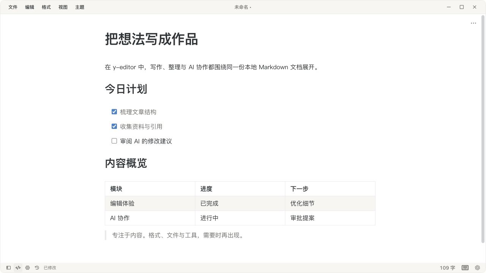
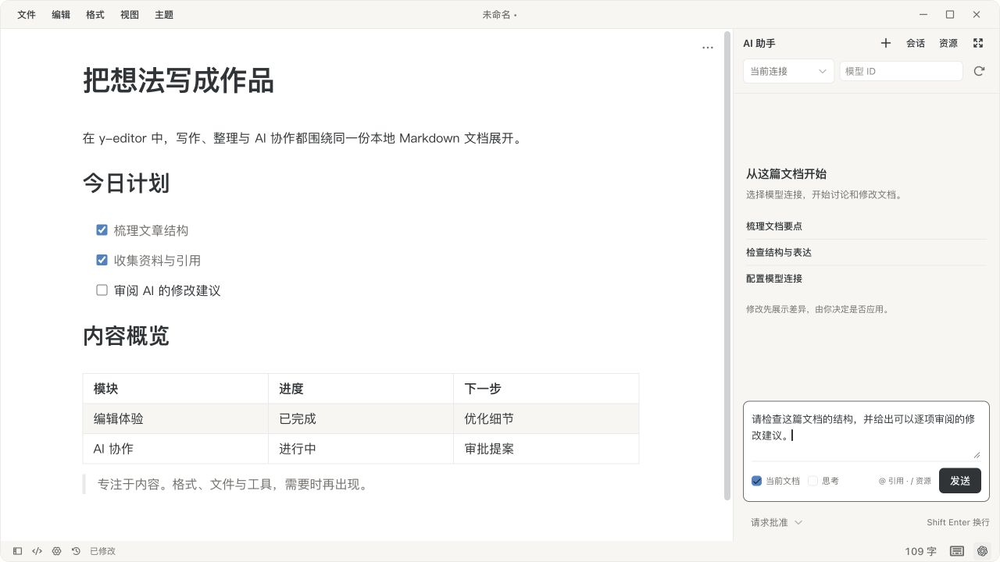

# y-editor

本地优先的 Markdown 桌面编辑器，让写作、文件管理与 AI 协作留在同一个工作区。基于 Tauri 2、Vue 3、TypeScript、Pinia 和 Milkdown，面向 macOS ARM64 与 Windows x64。项目仍在持续开发；[Typora 对标表](docs/TYPORA_PARITY.md)记录了已实现能力与尚未完成的部分。

## 核心优势

- **专注写作，也能精细编辑。** 默认是居中正文和即时渲染；需要时切换源码模式、打开大纲与查找，或使用专注/打字机模式。表格支持多选、行列调整和撤销；数学公式与 Mermaid 图在本地渲染。
- **文件始终由你掌握。** 直接编辑本地 Markdown 文件，支持文件夹工作区、多窗口、全文搜索、自动保存与草稿恢复。原子保存和外部修改冲突检测保护原文；读取和保存时保留 BOM、CRLF 等文件格式信息。
- **AI 修改先审阅，再落到文档。** 助手可结合当前文档、工作区搜索和选中的引用讨论内容。修改以差异提案呈现，可逐片段选择；默认请求批准，也可按会话选择自动审批模式。审批时检查文档冲突，避免覆盖你之后的修改。
- **按需接入自己的工具。** 支持 OpenAI-compatible / Anthropic-compatible 模型连接，以及本地知识源、只读仓库、Skills、提示词和 MCP。资源需显式启用；模型密钥由系统凭据库保存，不提供给前端读取。

## 界面预览



即时渲染的写作界面：正文、待办列表和表格在同一视图中编辑，工具栏按需出现。



AI 协作界面：带入当前文档，选择模型连接和审批模式，在应用修改前查看差异。截图使用示例文档；AI 对话需要桌面版与已配置的模型连接。

## 更多功能

- 原生打开/保存/另存为、目录树/列表、最近文件、快速打开、ripgrep 全文搜索，以及新建、重命名、复制和移入废纸篓。
- 本地图片粘贴/拖入与相对路径；Mermaid 支持缩放、拖动、全屏和 SVG/PNG 导出。
- 浅色/深色/系统主题、字体与版式设置、可视化主题参数、自定义 CSS，以及 Typora CSS 尽力兼容导入。
- HTML 导出、系统打印/PDF 和便携 ZIP。多窗口各自拥有工作区、AI 会话与恢复草稿。
- AI 流式响应、取消、会话历史；本地知识检索附文件与行号，MCP 支持 stdio 与 Streamable HTTP。

## 开发和构建

需要 Node.js 22.12+、pnpm 9.9.0、Rust stable，以及 [Tauri 系统依赖](https://v2.tauri.app/start/prerequisites/)。目标平台是 macOS ARM64、Windows x64。

```sh
pnpm install --frozen-lockfile
pnpm sidecars          # 下载固定版本并核对 SHA256
pnpm tauri dev         # 完整桌面版
# 或 pnpm dev          # 仅浏览器 UI 预览，不提供文件/AI IPC
pnpm tauri build --bundles app  # macOS
# Windows: pnpm tauri build --no-bundle
pnpm package:portable
```

便携 ZIP 输出到 `artifacts/`，包含应用、`portable.flag`、数据目录和 SHA256 校验文件。macOS 的 flag 放在 `.app` 旁边；Windows 放在 `.exe` 旁边。密钥不会随便携数据移动。macOS 使用 ad-hoc 签名，未做 Apple 公证；Windows 包需要 WebView2，且未做 Authenticode 签名。

Milkdown、CodeMirror、KaTeX 字体与 Mermaid 均由构建工具打包，不依赖运行时 CDN。Pi 及其运行资源、ripgrep 会随应用打包。首次安装和下载依赖需要网络。

## 验证

```sh
pnpm lint
pnpm typecheck
pnpm test
pnpm test:ai
pnpm build
cargo fmt --manifest-path src-tauri/Cargo.toml --check
cargo clippy --manifest-path src-tauri/Cargo.toml --all-targets -- -D warnings
cargo test --manifest-path src-tauri/Cargo.toml
```

AI 合约测试运行真实 Pi sidecar，模型端为本机 Mock Server，不需要 API Key。Rust 测试覆盖文件边界、BOM/CRLF、过期版本保存拒绝、配置迁移、IPC 限制、知识源开关，以及 MCP stdio 与 HTTP/SSE。

CI 配置覆盖两个目标平台。`v*` tag 构建便携包并创建草稿 Release；本地生成工作流不表示远端已执行。

## 当前限制

详见 [功能验收表](docs/TYPORA_PARITY.md)。知识库当前使用本地文本块与关键词排序，没有向量 embedding；MCP 当前不含 OAuth、服务环境变量编辑或工具级授权；CSS 导入不复制相邻字体/图片资源。远程图片下载/上传适配器、完整 Markdown AST 光标映射、性能基线及 Windows 实机回归尚需继续完善。原生 PDF 输出取决于系统打印对话框。

## 文档

- [完整实施方案](docs/IMPLEMENTATION_PLAN.md)
- [架构](docs/ARCHITECTURE.md) / [安全边界](docs/SECURITY.md) / [ADR](docs/ADR/0002-local-files-and-agent-boundaries.md)
- [Typora 对标](docs/TYPORA_PARITY.md) / [依赖](DEPENDENCIES.md) / [编辑器集成](PATCHES.md)

应用自身的开源许可证待项目所有者确定。第三方依赖沿用其各自许可证。
